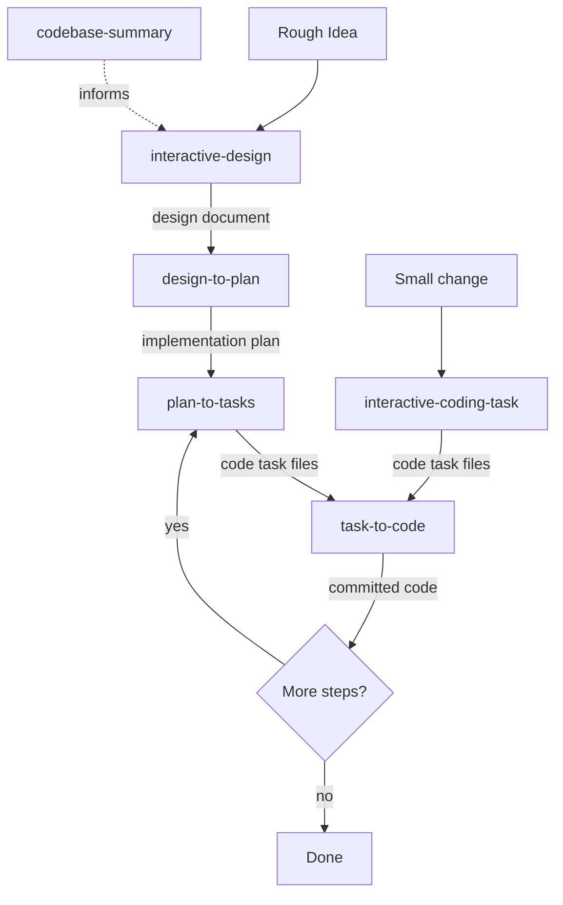

# Structured Spec-to-Code Workflow

## Pipeline Overview

- **codebase-summary** — Analyze an existing codebase. Run before interactive-design for brownfield projects, or anytime the summary is stale
- **interactive-coding-task** — Shortcut for small, well-scoped changes that skip design/plan. Feeds directly into task-to-code

## Determining Current State

Check for existing artifacts to determine where the user is in the pipeline:

| Check | If found | Next skill |
|---|---|---|
| No project directory | Starting fresh | interactive-design (or interactive-coding-task for small changes) |
| `{project_dir}/idea-honing.md` exists but no `design/detailed-design.md` | Requirements gathered, design not started | interactive-design (resume at Step 6) |
| `{project_dir}/design/detailed-design.md` exists but no `implementation/plan.md` | Design complete, no plan yet | design-to-plan |
| `{project_dir}/implementation/plan.md` exists with unchecked items | Plan exists, tasks not yet generated for next step | plan-to-tasks |
| `.agents/tasks/{project_name}/step{NN}/` contains `.code-task.md` files | Tasks generated, ready to implement | task-to-code |
| All plan checklist items complete | Pipeline complete for this project | Done — suggest review or next iteration |

## Typical Flow

1. **(Optional)** Run **codebase-summary** if working in an existing codebase and no current summary exists at `.agents/summary/`
2. Run **interactive-design** with the rough idea → produces `{project_dir}/design/detailed-design.md`
3. Review the design (possibly across multiple sessions for "fresh eyes")
4. Run **design-to-plan** → produces `{project_dir}/implementation/plan.md`
5. For each step in the plan:
   a. Run **plan-to-tasks** → produces `.agents/tasks/{project_name}/step{NN}/` with code task files
   b. Run **task-to-code** on each task file in sequence → produces committed code
6. Repeat 5a-5b until all plan steps are complete

## Shortcut Flow (Small Changes)

For small, well-scoped changes that don't need a full design:

1. Run **interactive-coding-task** with the description → produces code task files
2. Run **task-to-code** on each task file → produces committed code

## Conventions

- **Project directory**: `.agents/planning/{project_name}/` — contains design artifacts (idea-honing, research, design)
- **Tasks directory**: `.agents/tasks/{project_name}/` — contains generated code task files
- **Scratchpad directory**: `.agents/scratchpad/` — contains working documents from task-to-code (mirrors tasks directory structure)
- **Codebase summary**: `.agents/summary/` — contains codebase documentation
