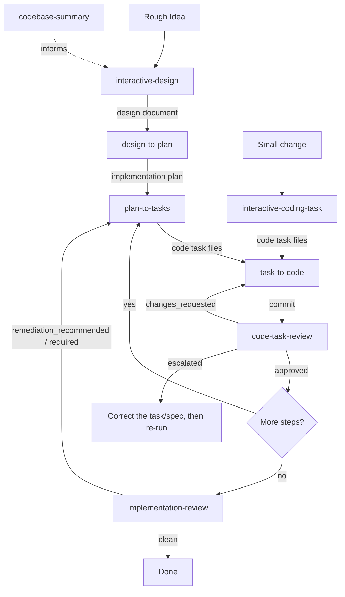

# Structured Spec-to-Code Workflow

## Pipeline Overview

- **codebase-summary** — Analyze an existing codebase. Run before interactive-design for brownfield projects, or anytime the summary is stale
- **interactive-coding-task** — Shortcut for small, well-scoped changes that skip design/plan. Feeds directly into task-to-code
- **code-task-review** — Runs after each `task-to-code` commit with clean context. Single-pass, cheap-model. Report at `{scratchpad}/review.yaml`
- **implementation-review** — Runs once when all plan steps are complete. Wider scope, opus-class model. Generates remediation `.code-task.md` files that re-enter the loop

## Parameters

- **agents_dir** (optional, default: `.agents`): Base directory for all workflow artifacts. Pass this through to every skill invoked in the pipeline

## Determining Current State

Check for existing artifacts to determine where the user is in the pipeline:

| Check | If found | Next skill |
|---|---|---|
| No project directory | Starting fresh | interactive-design (or interactive-coding-task for small changes) |
| `{project_dir}/idea-honing.md` exists but no `design/detailed-design.md` | Requirements gathered, design not started | interactive-design (resume at Step 6) |
| `{project_dir}/design/detailed-design.md` exists but no `implementation/plan.md` | Design complete, no plan yet | design-to-plan |
| `{project_dir}/implementation/plan.md` exists with unchecked items | Plan exists, tasks not yet generated for next step | plan-to-tasks |
| `{agents_dir}/tasks/{project_name}/step{NN}/` contains `.code-task.md` files | Tasks generated, ready to implement | task-to-code |
| `task-to-code` just committed and `{scratchpad}/review.yaml` does not exist for that task | Task implemented, not yet reviewed | code-task-review |
| `{scratchpad}/review.yaml` has `verdict: changes_requested` | Review surfaced fixable issues (including fixable `critical` findings) | task-to-code (in remediation mode, addressing the findings) |
| `{scratchpad}/review.yaml` has `verdict: escalated` | The loop cannot usefully continue — the change is unrecoverable, or the task itself is defective/ambiguous (see `escalation.reason`) | Correct the task/spec first, then re-run `task-to-code`; do not rework against the defective task |
| All plan checklist items complete and `{project_dir}/implementation/review.yaml` does not exist | Implementation complete, not yet reviewed at the project scope | implementation-review |
| `{project_dir}/implementation/review.yaml` has `verdict: remediation_recommended` or `remediation_required` and the generated remediation step is unchecked | Implementation reviewed, remediation tasks queued | task-to-code (on the new remediation step's tasks) |
| All plan checklist items complete and `{project_dir}/implementation/review.yaml` has `verdict: clean` | Pipeline complete for this project | Done — suggest next iteration |

## Typical Flow

1. **(Optional)** Run **codebase-summary** if working in an existing codebase and no current summary exists at `{agents_dir}/summary/`
2. Run **interactive-design** with the rough idea → produces `{project_dir}/design/detailed-design.md`
3. Review the design (possibly across multiple sessions for "fresh eyes")
4. Run **design-to-plan** → produces `{project_dir}/implementation/plan.md`
5. For each step in the plan:
   a. Run **plan-to-tasks** → produces `{agents_dir}/tasks/{project_name}/step{NN}/` with code task files
   b. For each task file: run **task-to-code** → committed code → **code-task-review** → if `changes_requested`, re-enter `task-to-code` to address findings, then re-review. If `escalated`, stop the loop and correct the task/spec before re-running
6. Repeat 5a-5b until all plan steps are complete
7. Run **implementation-review** → if remediation is needed, the skill writes new task files and a new step into the plan; resume from step 5b for that step. If `clean`, the project is done

## Shortcut Flow (Small Changes)

For small, well-scoped changes that don't need a full design:

1. Run **interactive-coding-task** with the description → produces code task files
2. Run **task-to-code** on each task file → produces committed code

## Conventions

- **Project directory**: `{agents_dir}/planning/{project_name}/` — contains design artifacts (idea-honing, research, design)
- **Tasks directory**: `{agents_dir}/tasks/{project_name}/` — contains generated code task files. Tasks from plan-to-tasks live under `step{NN}/` subdirectories; tasks from interactive-coding-task live directly in the project folder
- **Scratchpad directory**: `{agents_dir}/scratchpad/` — contains working documents from task-to-code (mirrors tasks directory structure)
- **Codebase summary**: `{agents_dir}/summary/` — contains codebase documentation
